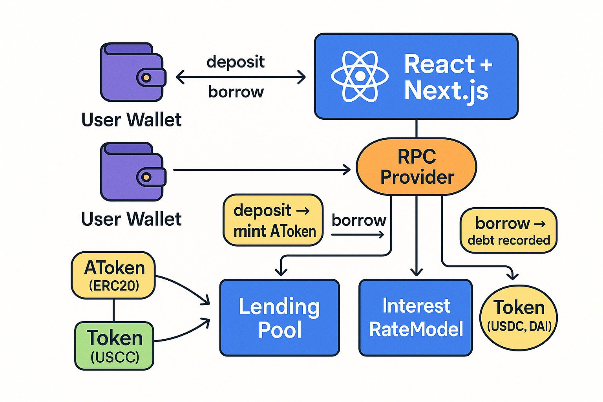
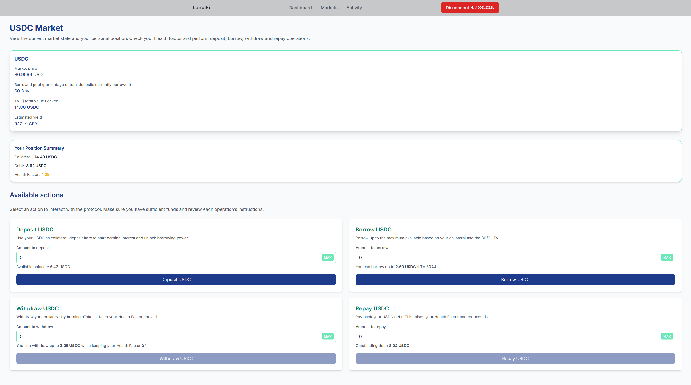
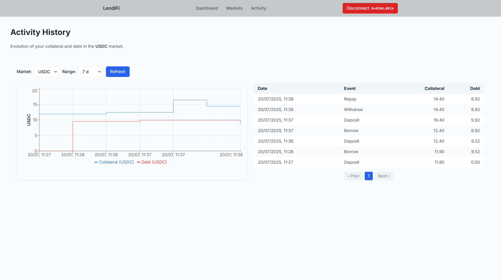
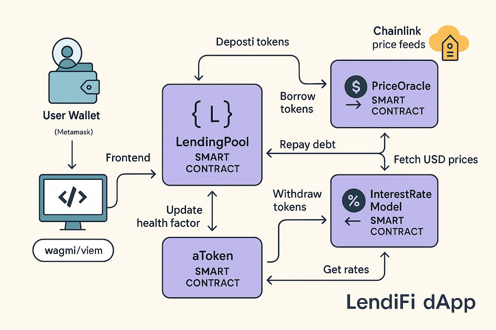

# LendiFi (Mini Aave)

A lean, Aave‑inspired DeFi lending & borrowing protocol with upgradable smart‑contracts and a modern React/Next.js frontend.

---

## What Is LendiFi?

Think of **LendiFi** as a crypto‑native savings‑and‑loan co‑op that runs entirely
on smart‑contracts:

- You **deposit** tokens (e.g. USDC, DAI) and immediately start earning interest.  
  In return you receive **aTokens** – receipts that grow in value over time.

- Those same deposits act as **collateral** that let you **borrow** other tokens
  without selling your original holdings, similar to taking a loan against
  your house or car.

- You can **repay** whenever you like to unlock more borrowing power or
  simply **withdraw** your collateral plus the interest you earned.

- If a borrower’s safety buffer – the **Health Factor** – ever falls below 1
  (meaning their loan is no longer fully backed), anyone on the network can
  **liquidate** that position: they repay part of the debt and receive a small
  bonus of the collateral.  
  This keeps the system solvent **without** needing a central authority.

| User Action   | What actually happens on‑chain                                                                                                  |
| ------------- | ------------------------------------------------------------------------------------------------------------------------------- |
| **Deposit**   | Smart‑contract mints interest‑bearing **aTokens** at a 1 : 1 ratio with the supplied ERC‑20.                                    |
| **Borrow**    | Contract locks your aTokens as collateral and transfers up to the allowed _Loan‑to‑Value (LTV)_ amount in the underlying token. |
| **Repay**     | Debt balance shrinks (principal + interest), restoring Health Factor.                                                           |
| **Withdraw**  | Contract burns your aTokens and releases the matching collateral.                                                               |
| **Liquidate** | When **HF < 1** a third party repays part of the debt and receives collateral at a 5 % discount.                                |

In short, LendiFi showcases the **core building blocks of a modern DeFi money
market** – deposits that earn yield, over‑collateralised loans, and automated risk
management – all wrapped in a clean React / Next.js frontend so anyone can try
it with testnet tokens.



---


## 🎬 Demo

Here are a couple of screenshots showing the Markets Dashboard—where you can deposit, borrow, repay, withdraw, and liquidate—and the Activity History view:

1. **Markets Dashboard** – where you can deposit, borrow, repay, withdraw, and liquidate assets.

   

2. **Activity History** – showing your collateral and debt over time.

   

## 🏗️ High‑Level Architecture

LendiFi follows a classic money‑market layout: a set of upgrade‑safe smart‑contracts on Sepolia plus a React / Next.js frontend that talks to them via wagmi + viem.



**How to read the diagram**

- **User wallets** (Metamask, Rabby…) connect through **WalletConnect / Injected Provider**.
- Frontend calls the **LendingPool** contract for `deposit`, `borrow`, `repay`, `withdraw`, `liquidate`.
- **aToken** is minted / burned 1‑to‑1 with the underlying collateral.
- **PriceOracle** fetches USD prices from Chainlink feeds.
- **InterestRateModel** returns dynamic borrow / deposit rates based on utilisation.
- Liquidations occur automatically when a position’s **Health Factor < 1**.

> **Source folders**
>
> - `contracts/` – Solidity contracts (`LendingPool.sol`, `AToken.sol`, `PriceOracle.sol`, `InterestRateModel.sol`)
> - `frontend/` – Next.js 14 dApp (pages, hooks, components)

---

## 🛠️ Core Tech Stack

| Layer               | Key Tools & Libraries        | Version             |
| ------------------- | ---------------------------- | ------------------- |
| **Smart‑Contracts** | Solidity                     | **0.8.28**          |
|                     | Hardhat                      | **2.24.3**          |
|                     | OpenZeppelin Contracts       | **5.3.0**           |
|                     | Ethers (JS SDK for scripts)  | **5.8.0**           |
| **Frontend**        | Next.js                      | **14.1.0**          |
|                     | React                        | **18.x**            |
|                     | TypeScript                   | **5.x**             |
|                     | TailwindCSS                  | **3.3.0**           |
|                     | wagmi (React Web3 hooks)     | **2.15.6**          |
|                     | viem (low‑level RPC)         | **2.31.4**          |
|                     | Ethers (JS SDK for dApp)     | **6.14.4**          |
| **State / Data**    | TanStack React‑Query         | **5.81.2**          |
| **Testing**         | Hardhat (Mocha/Chai)         | built‑in            |
|                     | Jest + React Testing Library | **30.0.2 / 16.3.0** |
| **CI / Deployment** | GitHub Actions · Vercel      | —                   |

## 📂 Repo Structure

```
lendifi/
├─ contracts/             # Solidity
├─ scripts/               # Deploy helpers
├─ test/                  # Contract tests
├─ frontend/              # Next.js dApp
│  ├─ app/ components/ hooks/ lib/ abis/ config/
│  └─ tailwind.config.ts
└─ README.md
```

---

# ⚙️ Quick Start

> **Requirements**  
> • Node 18 + (LTS) • Git • MetaMask (or any EVM wallet)

---

## 1 Clone + Install

```bash
git clone https://github.com/EnricCoding/lendifi.git
cd lendifi

# Root deps – Hardhat, tests, scripts
npm install

# Frontend deps
cd frontend && npm install
cd ..        # back to repo root
```

---

## 2 Create `.env` files

```bash
cp .env.example              .env
cp frontend/.env.example     frontend/.env.local
```

| Key                       | File                  | Purpose                                                                              |
| ------------------------- | --------------------- | ------------------------------------------------------------------------------------ |
| `PRIVATE_KEY`             | `.env`                | Your wallet private key. Throw‑away account you control (**never commit real keys**) |
| `SEPOLIA_RPC`             | `.env`                | Create account in Alchemy/Infura and get the HTTPS endpoints                         |
| `NEXT_PUBLIC_SEPOLIA_RPC` | `frontend/.env.local` | Same RPC for the dApp                                                                |
| `NEXT_PUBLIC_*_ADDRESS`   | `frontend/.env.local` | **Leave blank** – will be filled after deploy                                        |

> **Tip:** Register in Alchemy (Web 3 Suite of APIs) <https://www.alchemy.com/>.
> **Tip:** Get free Sepolia ETH at <https://faucet.circle.com/>.

---

## 3 Compile & Deploy to Sepolia

```bash
# compile (re‑generates ABIs)
npx hardhat compile

# deploy
npx hardhat run scripts/deploy.ts --network sepolia
```

Sample output:

```
Deploying with: 0xYourDeployer…
AToken             → 0x4A345C803817D2a195854b0F1198d716FF050C6C
PriceOracle        → 0x9ed1D24E4CcCd4D65026f0DE7223907A3f227553
InterestRateModel  → 0x2de9e3f37fB210ECa960DBaB2C4270A44D29e646
LendingPool        → 0x3B9DcEfE78447A945F12b727373a80FeA3f212e3
Ownership of aToken transferred to LendingPool
```

Copy **only** these addresses into `frontend/.env.local`:

```dotenv
NEXT_PUBLIC_LENDING_POOL_ADDRESS=0x3B9DcEfE78447A945F12b727373a80FeA3f212e3
NEXT_PUBLIC_RATE_MODEL_ADDRESS=0x2de9e3f37fB210ECa960DBaB2C4270A44D29e646
NEXT_PUBLIC_ORACLE_ADDRESS=0x9ed1D24E4CcCd4D65026f0DE7223907A3f227553
```

---

## 4 Launch the Frontend

```bash
cd frontend
npm run dev       # ⇢ http://localhost:3000
```

Open the site, connect MetaMask (Sepolia network) with **the same deployer account** or any funded test wallet.

You’re ready – Deposit → Borrow → Repay → Withdraw → Liquidate 🎉

---

## Keeping ABIs in Sync

Whenever you change Solidity:

```bash
npx hardhat compile
```

The freshly generated ABIs land in `artifacts/` and are automatically used by `scripts/deploy.ts`. After redeploying, update the three `NEXT_PUBLIC_*_ADDRESS` values in `frontend/.env.local`, rebuild (Vercel) or restart `npm run dev`, and you’re good to go.

---

## 🧪 Testing

```bash
# contracts
npx hardhat test
# coverage
npx hardhat coverage
# frontend
cd frontend && npm test
```

---

## 🚀 Deploy to Sepolia

```bash
npx hardhat run scripts/deploy.ts --network sepolia
```

(Optional) If do you want to deploy the project finally, push `frontend/` to Vercel and add environment variables.

---

# 📈 Protocol Metrics — Quick Reference

| Metric                   | What it measures                                                                   | Formula / Units                          |
| ------------------------ | ---------------------------------------------------------------------------------- | ---------------------------------------- |
| **Utilisation** (`u`)    | Share of supplied liquidity currently borrowed.<br>0 % = idle, 100 % = fully lent. | `u = totalDebt ÷ totalCollateral`        |
| **Borrow APR**           | Annual percentage rate paid by borrowers (simple, non‑compounded).                 | `APR = InterestRateModel.borrowRate(u)`  |
| **Deposit APY**          | Effective annual yield earned by suppliers (compounded).                           | `APY ≈ Borrow APR × u`                   |
| **Health Factor** (`HF`) | Safety buffer of a user’s position; liquidation when `HF < 1`.                     | `HF = (Collateral × Price × LTV) ÷ Debt` |

> **Rule of thumb**  
> • `HF > 2` = very safe • `1 < HF ≤ 2` = monitor position • `HF ≤ 1` = at risk of liquidation

---

## 🔍 Glossary

| Term                  | Description                                                                  |
| --------------------- | ---------------------------------------------------------------------------- |
| **LTV**               | _Loan‑to‑Value_. Max % of collateral value that can be borrowed (e.g. 80 %). |
| **WAD / RAY**         | Fixed‑point math units: WAD = 10¹⁸, RAY = 10²⁷.                              |
| **Reserve Factor**    | Share of interest routed to the protocol treasury.                           |
| **Liquidation Bonus** | Extra collateral a liquidator receives as incentive (e.g. 5 %).              |

---

## 🤝 Contributing

Fork, branch, commit with conventional commits, open a PR and pass the CI pipeline!

---

## 📜 License

MIT © 2025 LendiFi
